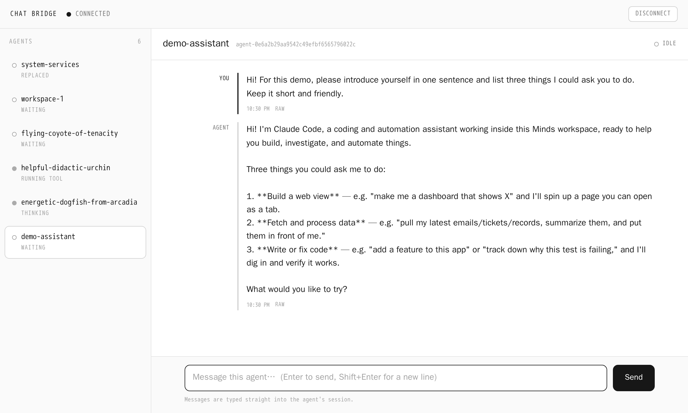

<p align="center">
  
</p>

<h1 align="center">Export Minds Chat Interface</h1>

<p align="center"><b>A REST API for driving a minds workspace's agents from outside — with a web UI that runs on the exact same API.</b></p>

## Install in Minds

<p align="center">
  <a href="https://boweiliu.github.io/open-in-minds/?git_url=https://github.com/boweiliu/export-minds-chat-interface"></a>
</p>

Didn't work? Create a Minds workspace and paste this to your agent:
`/use-inspiration https://github.com/boweiliu/export-minds-chat-interface`

## Why you care

Your Minds workspace has AI agents working for you — but normally you can only reach them from inside the Minds app. This gives them a secure front door, so you can check on them and send them tasks from anywhere: your phone, a quick script, or even another AI assistant. One key, like a password, unlocks it. With that key you can see what each agent is doing right now, send any of them a message, and read the whole conversation back.

## How to use it — basic

Open the **chat-bridge** tab (or its web page) and paste your key once. You get a simple console: a list of your agents, each with a live status — idle, thinking, or working on something — the conversation you click into, and a box to type a message straight to that agent.

Want it on your phone? The page has a share link and a QR code that open the same console there. No code, nothing to install.

Want to connect your other AI agents and let them drive your Minds workspace? Give them the bridge's URL and this key, and point them at `/llms.txt`.

## How to use it — advanced

Everything the console does is a plain REST + SSE API, so your own scripts can drive it too. The key is generated on first boot into `data/.secrets/chat_bridge.env` — read it there, or ask your workspace agent. Authenticate with `Authorization: Bearer <token>` on every request.

```bash
export CHAT_BRIDGE_URL="https://<your-bridge-host>"
export CHAT_BRIDGE_TOKEN="<the bridge token>"

# list agents (with live status)
curl -s -H "Authorization: Bearer $CHAT_BRIDGE_TOKEN" "$CHAT_BRIDGE_URL/api/agents"

# send a message into an agent's session (id OR unique name)
curl -s -X POST -H "Authorization: Bearer $CHAT_BRIDGE_TOKEN" \
  -H "Content-Type: application/json" -d '{"message":"status?"}' \
  "$CHAT_BRIDGE_URL/api/agents/<agent-id-or-name>/message"

# follow a conversation live over SSE
curl -sN -H "Authorization: Bearer $CHAT_BRIDGE_TOKEN" \
  "$CHAT_BRIDGE_URL/api/agents/<agent-id-or-name>/stream"
```

**Python client.** `src/chat_bridge/client.py` is a single file with zero third-party dependencies — copy it anywhere with Python 3, or use it in-repo (`uv run chat-bridge-client list` / `send` / `tail`).

## Auth & security

A single bearer token gates every agent operation (constant-time check; generated on first boot). Without it you can see the API's shape but read no data and take no action. A dedicated tunnel exposes only the token-gated bridge, never the workspace's raw internal API on loopback.

---

*Built as a minds inspiration — a bootable snapshot another mind can adopt and adapt.*
